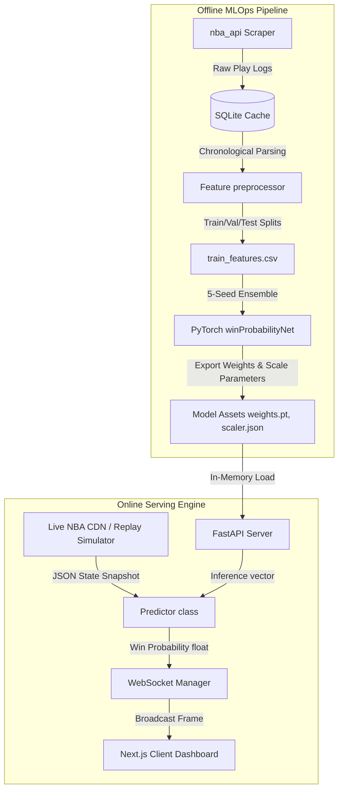

# ClutchNet: Real-Time NBA Win Probability Engine

[](https://www.python.org/)
[](https://pytorch.org/)
[](https://fastapi.tiangolo.com/)
[](https://nextjs.org/)

**ClutchNet** is an end-to-end machine learning and real-time data streaming platform that calculates and visualizes live NBA win probabilities. By processing historical play-by-play datasets using a custom PyTorch neural network, the system performs sub-second inference on current game configurations and streams dynamic updates to a high-performance, responsive Next.js sports broadcast dashboard via WebSockets.

This codebase serves as a full-stack MLOps template, bridging offline deep learning training with a low-latency, event-driven online streaming environment.

---

## 🚀 Core Platform Features

1. **Multi-Seed Ensemble PyTorch Model:**
   - Leverages a deep Multilayer Perceptron network with LayerNorm and Dropout layers trained across an ensemble of 5 distinct random seeds (42, 123, 456, 789, 999).
   - Achieves **77.26% test accuracy** and a **0.8618 ROC-AUC score**, with verified model calibration mapping predicted probabilities close to empirical outcomes.
2. **Arena Scoreboard & Court-Grid UI:**
   - Designed around a premium, immersive dark basketball court theme with soft gridlines and stadium jumbotron style panels.
   - Utilizes condensed, high-visibility athletic typography (`Barlow Condensed`) mimicking modern NBA arena displays.
3. **Dynamic Team-Colored Theme Glows:**
   - Detects the active team abbreviations (`BOS`, `LAL`, `CHI`, etc.) and dynamically shifts accent lines, possession indicators, and card glows to match official brand colors.
4. **Interactive Probability Pulse Curve:**
   - Plots a horizontally scrolling area chart using Recharts. 
   - Uses dual linear gradients for the line stroke and area fill, transitioning color dynamically from the home team's color (when home is winning) to the visitor team's color (when visitors lead).
5. **Physical Ticket Stub Game Cards:**
   - Renders available historical games in the sidebar with notch cutouts and dashed tear-off lines representing physical admission tickets.
6. **Accelerated Historical Replay (Demo Mode):**
   - An integrated simulation controller running on FastAPI allows replaying any of the 13,000+ cached regular season or synthetic games at speeds ranging from 1x to 100x.
7. **No-Active-Subscription Sleep Mode:**
   - The live polling worker automatically suspends external API queries when no frontend clients are actively listening, minimizing resource consumption.

---

## 🏗️ System Architecture



---

## 📊 Machine Learning Features (19 Inputs)

To calculate probabilities, the PyTorch model evaluates the game configuration at any second based on 19 scaled inputs:
- **Temporal Context:** `period`, `seconds_remaining_in_period`, `seconds_remaining_in_game`, `is_overtime`.
- **Score Dynamics:** `home_score`, `away_score`, `score_margin`, `largest_lead`, `lead_changes`.
- **Possession Mechanics:** `possession` (1: Home, -1: Away, 0: Neutral).
- **Resource Constraints:** `home_timeouts_remaining`, `away_timeouts_remaining`, `home_fouls`, `away_fouls` (penalty counters).
- **Baseline Strength:** Pregame ELO ratings (`home_pregame_rating`, `away_pregame_rating`) calculated dynamically using seasonal rolling statistics.
- **Momentum Context:** `home_pts_last_3_min`, `away_pts_last_3_min` (sliding lookback window).

---

## 📁 Repository Structure

```
├── backend
│   ├── data
│   │   ├── raw/               # SQLite database cache (13,224 games)
│   │   ├── processed/         # Train/Val/Test CSV features
│   │   ├── scraper.py         # Handles NBA API ingestion and mock generators
│   │   ├── bulk_scraper.py    # Multi-season robust scraping script
│   │   └── preprocessor.py    # Rolling Elo, timeout, foul, and momentum engineering
│   ├── model
│   │   ├── network.py         # PyTorch WinProbabilityNet layout
│   │   ├── train.py           # Multi-seed optimizer and evaluator script
│   │   ├── predictor.py       # Dependency-free scaled inference wrapper
│   │   └── weights.pt         # Ensemble model weights
│   ├── main.py                # FastAPI HTTP routing & WS servers
│   ├── ws_manager.py          # WebSocket client registers and broadcasters
│   ├── simulator.py           # Accelerated replay event loops
│   ├── live_poller.py         # Real-time CDN polling worker
│   └── tests/                 # Unit test suite (Serving, Predictor, Preprocessor)
└── frontend
    ├── src
    │   ├── app/               # Next.js App Router (Scoreboard, main page layout)
    │   ├── components/        # UI (PulseChart, Sidebar, ControlPanel, MomentumBar, Ticker)
    │   ├── hooks/             # WebSocket connections state hook
    │   └── utils/             # TeamColors utility configuration mappings
    └── package.json           # Tailwind CSS v4 & Next.js details
```

---

## ⚙️ Running the Project Locally

### Prerequisites
- Python 3.10+
- Node.js 18+

### Setup Instructions

1. **Clone the Repository:**
   ```bash
   git clone https://github.com/ahmedmurtazamalik/clutchnet.git
   cd clutchnet
   ```

2. **Initialize the Python Backend:**
   Create a virtual environment, install dependencies, and start the FastAPI uvicorn server:
   ```bash
   cd backend
   python -m venv .venv
   # Windows Activation:
   .\.venv\Scripts\activate
   # macOS/Linux Activation:
   source .venv/bin/activate
   
   pip install -r requirements.txt
   uvicorn main:app --reload
   ```
   *The FastAPI server will be active at `http://127.0.0.1:8000`.*

3. **Initialize the Next.js Frontend:**
   Open a separate terminal window and launch the dev server:
   ```bash
   cd frontend
   npm install
   npm run dev
   ```
   *The Next.js dashboard will be active at `http://localhost:3000`.*

4. **Verify Correctness:**
   To run the complete suite of preprocessor, model, and REST/WebSocket integration unit tests, navigate to the `backend` folder with your virtual environment active and run:
   ```bash
   python -m unittest discover -s tests
   ```

---

## 🎨 Visual Redesign Details (Before vs. After)

A comprehensive redesign has been implemented to replace generic tech layouts with an authentic sports broadcast interface:
* **The "Jumbotron" Scoreboard:** The top banner layout is modeled on an arena center-hung display with retro scoreboard digital timers.
* **The Hardwood Floor:** A custom court-grid line shader is layered onto a deep charcoal mesh background.
* **Admission Tickets:** Matchups in the sidebar list are styled as physical tickets complete with circular coupon border cuts and dashed separation lines.
* **Tug-of-War Momentum:** A visual progress display shifts dynamically using playing team colors to represent points scored during the last 3 minutes of clock time.